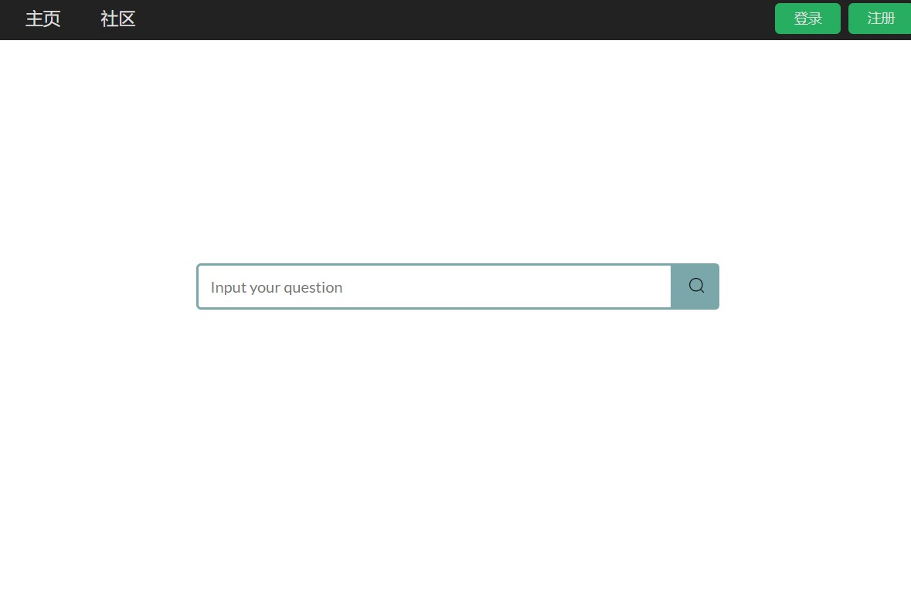
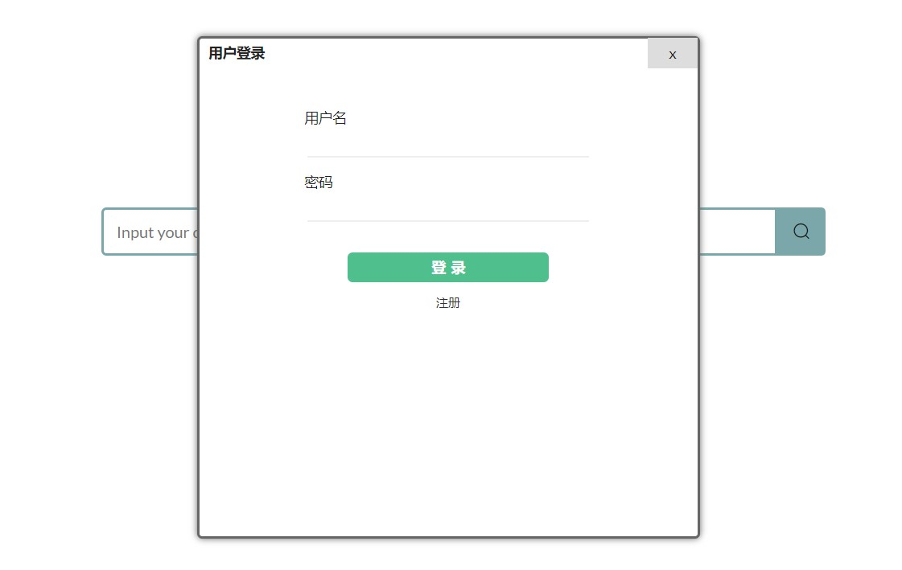
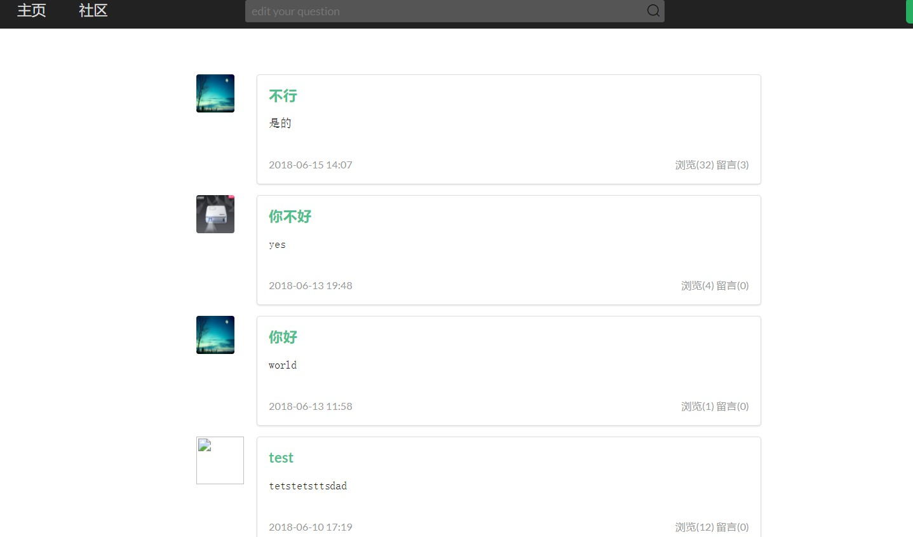

# CodingSearch

## **项目成员**

## **项目描述**
实现一个代码问题查询网站PC端，提供一个程序问题的多种解决方法。

## **界面设计**
1. 查询界面
    
   1. 可到达登陆界面
   2. 可到达社区主页
   3. 可到达查询界面
2. 登陆界面
    
   1. 可到达用户界面
3. 用户界面
    
   1. 个人信息，回答的问题，提出的问题
    
   2. 提出问题功能
   3. 可到达社区界面
   4. 可到达查询界面

4. 社区界面
    

## **数据结构**

user:
id|name|password|avatar|gender|bio
---|:--:|:--:|:--:|:--:|---:

post:
id|author|title|content|pv
---|:--:|:--:|:--:|:---

comments:
id|author|content|postId
---|:--:|:--:|:---

## **功能模块**
1. 主页查询问题
2. 登陆用户问题解答
3. 社区主页最热问题
4. 待续...
